# 基整促E17　共同住宅の省エネ性能評価における暖冷房負荷モデルの精緻化に関する検討 (ロ)簡易な入力方法の検討

2022・2023年度に実施した検討に関して整理しています。ただし、2022年後半から大きく方針転換をして
おり、2022年前半のデータ(2022年度の報告書における「簡易な入力方法①」)は含みません。

## 概要

簡易な入力方法の検討では、概要図に示すように、以下のステップで面積を推定します。
- 参照住戸の外皮面積・間仕切り面積を床面積・総外皮面積を基に面積補正を実施する。
- UA値を基に外気に接する外皮の面積の比率を推定し、外皮面積を外皮気接する面とそれ以外に分割する。
- ηAC値から外気に接する外皮に占める開口部面積の比率を求め、外気に接する外皮の面積に開口部を割り付けます。

面積の推定後は、外皮のU値を求め、次にηA値を求めます。ηA値から地域の区分に応じてηAC値とηAH値を推定します。
この方法では、建物の延べ床面積・主たる居室の面積・その他の居室の面積・総外皮面積・UA値を担保したうえで、
極力参照住戸に近い建物を生成します。ηAC値・ηAH値については完全には担保されないものの、極力近い値になるように
制御します。

## 報告書

`reports/3_simple_input_report.pdf` です。
最終年度の報告書において、「(ロ)簡易な入力方法の検討」に相当する部分に対応します。

## 簡易な入力方法の実装

### Python実装

簡易な入力方法のPython実装は `simple_input_r5.py` です。入力は以下の通りです。

- 地域の区分 = 1 | 2 | 3 | 4 | 5 | 6 | 7 | 8
- 延床面積 [m2]
- 主たる居室の面積 [m2]
- その他の居室の面積 [m2]
- 総外皮面積 [m2]
- UA値 [W/m2K]
- ηAH値 [%]
- ηAC値 [m2]
- 建て方 = 共同住宅 | 戸建住宅
- 構造(戸建住戸のみ) = 床断熱 | 基礎断熱

`estimate`関数に条件を入力すると、推定結果のExcelファイルが出力されます。
Excelファイルを `to_json` 関数に入力すると、熱負荷計算エンジンが処理できる JSONデータが取得できます。

なお、`estimate`関数は生成するExcelファイルのテンプレートとして、以下の3ファイルを使用します。

- `sinple_input_excel_template_kyodo.xlsx` (共同住宅)
- `sinple_input_excel_template_kodate_yukadan.xlsx` (戸建住宅・床断熱)
- `sinple_input_excel_template_kodate_kisodan.xlsx` (戸建住宅・基礎断熱)

### Excel実装

簡易な入力方法のExcel実装は `simple_input_r5.xlsx` です。
推定結果のExcelファイルは出力しません。以下の値を出力します。

- 外皮の種類・方位・空間別の面積
- 間仕切り面積
- 部位の種類ごとのU値
- 部位の種類ごとの断熱材のR値
- 窓の日射熱取得率
- 空間ごとの容積と換気量

## サンプル生成および計算

感度分析のためサンプルを2種類の方法で生成しました。共同住宅のみ756通り生成する方法と、戸建・共同住宅を180通り生成する方法です。どちらの方法も、テンプレートとなるExcelファイルを書き換えてサンプルを生成します。最終的な生成物は熱負荷計算エンジンが処理できる JSONデータです。生成されたJSONデータはGoogle Cloud Batchを使って一括計算を実施しました。

### 共同住宅のみ756通り生成する方法

`experiments/sample_generator` 以下に実装が含まれています。条件は報告書の「3.3.8 U_A値およびη_A 値の一致の検証(共同住宅のみ・756通り)」に記述されています。このサンプルが使われているのは報告書の3.3.8のみです。

### 戸建・共同住宅を180通り生成する方法

`experiments/sample_generator_kodate` 以下に実装が含まれています。条件は報告書の「3.3.9 U_A値およびη_A  値の一致の検証(戸建住宅込み・180通り)」に記述されています。このサンプルが使われているのは報告書の3.3.9, 3.3.11, 3.3.12 です。

### 一括計算の実施

`experiments/calc_hc_kodate` を参照してください。

### 計算結果

`reports/result_kodate` 及び `reports/result_kodate_yukadannnetsu` には、 
`experiments/sample_generator_kodate`を用いて生成した180通りに対する一括計算が格納されています。
ただし、`result_kodate_yukadannnetsu` は 断熱位置を考慮しない方法、 `result_kodate` には断熱位置を考慮した方法を
用いた違いがあります。

## パラメータ計算

外気に接する外皮面積の比率および開口部面積の比率についてはロジスティックス回帰分析を行っています。

### 外気に接する外皮の面積割合の推定式のパラメータ計算

`reports/3_3_6_r_env_ex.ipynb` を参照してください。

### 開口部面積割合の推定式のパラメータ計算

`reports/3_3_7_r_env_op.ipynb` を参照してください。

## 検証

### U_A値およびη_A値の一致の検証(共同住宅のみ・756通り)

`reports/3_3_8_UA_etaA_validation_kyodo.ipynb` を参照してください。

### U_A値およびη_A値の一致の検証(戸建住宅込み・180通り)

`reports/3_3_9_UA_etaA_validation_kodate.ipynb` を参照してください。

### 極端な住戸での簡易入力方法の再現性確認

`reports/3_3_10_extreme_house` を参照してください。

### 年間熱負荷の検証(戸建住宅込み・180通り)

`reports/3_3_11_annual_heat_load.ipynb` を参照してください。

### 断熱位置の入力の年間熱負荷への影響の検証(戸建住宅・144通り)

`reports/3_3_12_insulation_position.ipynb` を参照してください。

### 建て方・断熱方法による面積・q値・m値の分解の確認

`3_3_13_area_q_m_distribution.xlsx` を参照してください。
